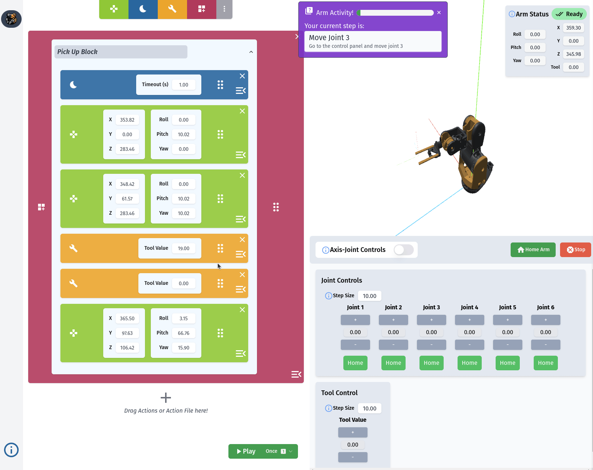

# Ribot: Robot Arm Controller

Welcome to the Ribot project, your comprehensive solution for controlling robotic arms with up to 6 degrees of freedom (DOF). This project encapsulates both firmware and software components tailored to deliver an exceptional user experience in robotic arm manipulation.



## Demo Video

[](https://www.youtube.com/watch?v=HM4zTVW9VRM)

[Click this or the image!](https://youtu.be/HM4zTVW9VRM)

## Getting Started

### Prerequisites
- Docker Desktop: [Download here](https://www.docker.com/products/docker-desktop/)
- Python 3.8 or higher
- ESPTool Python package for firmware flashing (Required, if using Docker):
  ```bash
  pip install esptool toml
  ```
- Alternatively, you can use your own install of ESP IDF (v5.1.1) for manual firmware flashing.

### Installation

1. **Clone the Repository**
   ```bash
   git clone https://github.com/alberto-abarzua/ribot.git
   ```

2. **ribot.py Script**
   This utility script facilitates building, running, and managing the project.
   - Usage: 
     ```bash
     python ribot.py --help
     ```

3. **Building the Firmware for ESP32**
   ```bash
   python ribot.py build-esp
   ```

4. **Flashing the Firmware**
   ```bash
   python ribot.py build-esp --flash
   ```

5. **Running Backend and Frontend Services**
   For real ESP32:
   ```bash
   python ribot.py runserver --esp
   ```
   For a dummy firmware version (Docker):
   ```bash
   python ribot.py runserver
   ```

## Project Components

### Firmware
- **Language**: C++
- **Framework**: ESP IDF
- **Target Platform**: ESP32 Microcontroller
- **Functionality**: Manages robotic arm control logic and real-time operations.

### Software
- **Backend**
  - **Language**: Python
  - **Framework**: FastAPI
  - **Functionality**: Facilitates communication between the frontend and firmware, processes control commands, and manages system state.
- **Frontend**
  - **Language**: JavaScript
  - **Framework**: React
  - **Functionality**: Provides a user interface for interacting with the robotic arm, sending commands, and receiving feedback.

## Communication
- Firmware to Backend: Sockets
- Frontend to Backend: WebSockets and HTTP requests

## Python Control Library for Ribot

The Ribot project utilizes a Python library, `ribot-controller`, to seamlessly integrate backend operations with the robot arm's firmware. This library is a pivotal component of the backend, enabling efficient and straightforward control of the robotic arm. It's available on PyPI and can be easily incorporated into Python-based applications.

### Key Features
- **Easy-to-Use Interface**: Provides simple and intuitive commands for robotic arm control.
- **Direct Connection with Firmware**: Ensures seamless communication between the backend and the robotic arm's firmware.
- **Python-based**: Leveraging Python's versatility and simplicity for robotic control tasks.

### Installation
To install `ribot-controller`, use pip:
```bash
pip install ribot-controller
```

### Example Usage
Below is an example illustrating how to use the `ribot-controller` library to control the robot arm:

```python
from ribot.control.arm_kinematics import ArmParameters, ArmPose
from ribot.controller import ArmController, Settings

if __name__ == "__main__":
    # Arm parameters (Physical dimensions of the arm)
    arm_params: ArmParameters = ArmParameters()
    arm_params.a2x = 0
    arm_params.a2z = 172.48

    arm_params.a3z = 173.5

    arm_params.a4z = 0
    arm_params.a4x = 126.2

    arm_params.a5x = 64.1
    arm_params.a6x = 169

    controller = ArmController(arm_parameters=arm_params)
    # The websocket server is used by the simulation in the Frontend
    controller.start(websocket_server=False, wait=True)

    controller.set_setting_joints(Settings.STEPS_PER_REV_MOTOR_AXIS, 400)
    controller.home()

    # Move to a position
    position = ArmPose(x=320, y=0, z=250, pitch=0, roll=0, yaw=0)
    controller.move_to(position)
    controller.wait_done_moving()

    # Move to angles (rads)
    angles = [0.0, 0.0, 0.0, 0.0, 0.0, 0.0]
    controller.move_joints_to(angles)

    # Move the tool (rads)
    controller.set_tool_value(1.2)

    print("Homed:", controller.is_homed)
```

This example demonstrates initializing the controller, setting up the arm parameters, and executing various movements including positioning, angling, and tool manipulation.

### Documentation
For detailed documentation, please visit our [Docs](https://ribot.dev).

### Contributing

Please feel free to contribute to this project! We welcome any and all contributions to help improve the Ribot project. We don't have any specific guidelines for contributing, but please follow the general guidelines below:

**Issues**: If you find any bugs or have any feature requests, please create an issue on GitHub.

**Pull Requests**: If you have any changes you'd like to make, please create a pull request on GitHub. We'll review it and merge it if it looks good!

**Code Style**: Follow the existing code style (formatting and linting). For python code, we use black, isort, mypy, and flake8. For C++ code, we use clang-format and clang-tidy. For JavaScript code, we use prettier and eslint.       
- You can check if you are following the code style by running `python ribot.py lint` in the root directory of the project. This will run all the linters and formatters on the codebase.
- To format the code, run `python ribot.py format` in the root directory of the project. This will run all the formatters on the codebase.

**Testing**: We have unit tests for the Python codebase. You can run them by running `python ribot.py test` in the root directory of the project.

### License
This project is licensed under the [MIT License](#).

---

Happy coding and controlling with Ribot! 🤖✨
